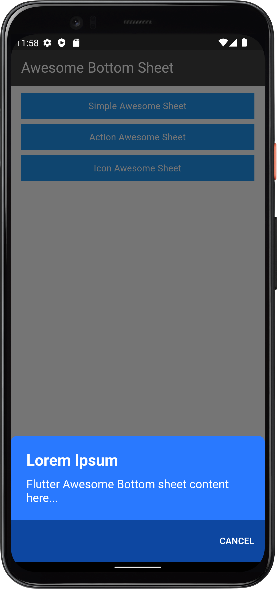
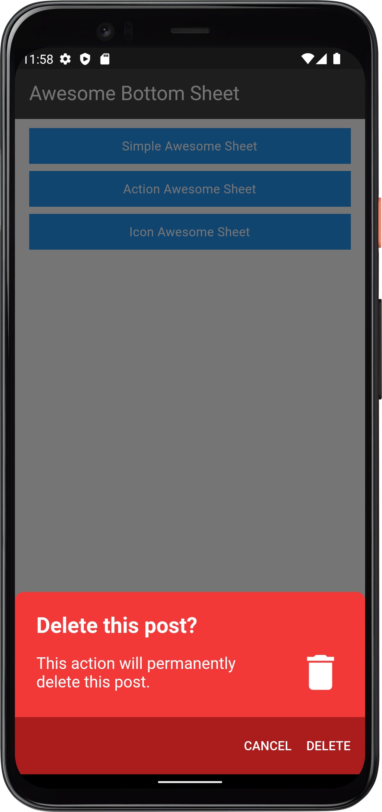
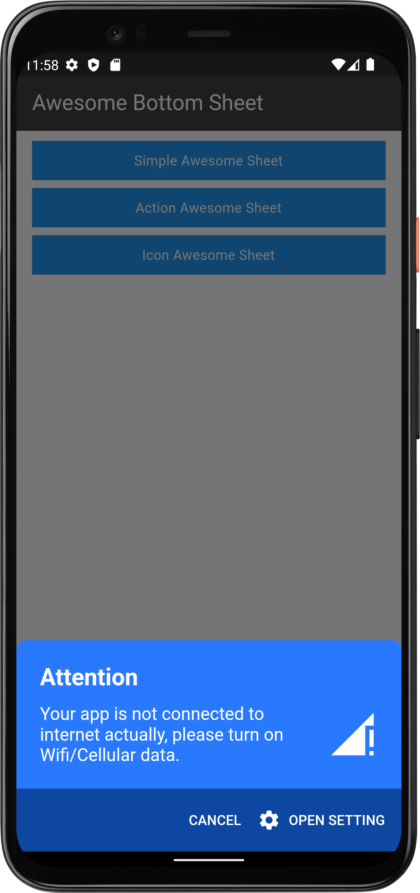

# Flutter Awesome Bottom Sheet

## Features

* Custom child widgets
* Adaptive design

## Supported platforms

* Flutter Android
* Flutter iOS
* Flutter web
* Flutter desktop
* Flutter macOS
* Flutter linux

## Installation

Add ```flutter_awesome_bottom_sheet: <later-version>``` to your `pubspec.yaml` dependencies. And import it:

```
import 'package:flutter_awesome_bottom_sheet/flutter_awesome_bottom_sheet.dart';
```

#### How to Use ####

## How to Use ##
create object
```
final AwesomeBottomSheet _awesomeBottomSheet = AwesomeBottomSheet();
```

## Example

Simple Awesome Sheet

```          
 _awesomeBottomSheet.show(
      context: context,
      title: const Text("Lorem Ipsum"),
      description: const Text("Flutter Awesome Bottom sheet content here..."),
      color: CustomSheetColor(
        mainColor: const Color(0xff2979FF),
        accentColor: const Color(0xff0D47A1),
        iconColor: Colors.white,
      ),
      positive: AwesomeSheetAction(
        onPressed: () {
          Navigator.of(context).pop();
        },
        title: 'CANCEL',
      ),
    );
```

## Add Buttons

```
 _awesomeBottomSheet.show(
     ...
      positive: AwesomeSheetAction(
        onPressed: () {
          Navigator.of(context).pop();
        },
        title: 'DELETE',
      ),
      negative: AwesomeSheetAction(
        onPressed: () {
          Navigator.of(context).pop();
        },
        title: 'CANCEL',
      ),
    );
```

Add Icons in content and action button

```

 _awesomeBottomSheet.show(
     ...
      icon: Icons.signal_cellular_connected_no_internet_4_bar,
      positive: AwesomeSheetAction(
        onPressed: () {
          Navigator.of(context).pop();
        },
        title: 'OPEN SETTING',
        icon: Icons.settings,
      ),
      negative: AwesomeSheetAction(
        onPressed: () {
          Navigator.of(context).pop();
        },
        title: 'CANCEL',
      ),
    );

```

## Custom color

```
 _awesomeBottomSheet.show(
      ...
      color: CustomSheetColor(
        mainColor: Colors.white,
        accentColor: const Color(0xff5A67D8),
        iconColor: const Color(0xff5A67D8),
      ),
      ...
    ); 
```

## Screenshot
|             Simple             |             Action             |             Icon             |
| :----------------------------: | :----------------------------: | :-------------------: |
|           |           |  |

